# Домашнее задание к занятию «TeamCity»

## Подготовка инфраструктуры

### 1.
На основе образа jetbrains/teamcity-agent инстанс создал сервер с Team city.
2CPU и 4RAM.
### 2. 
Установил Team City и создал аккаунт "admin"

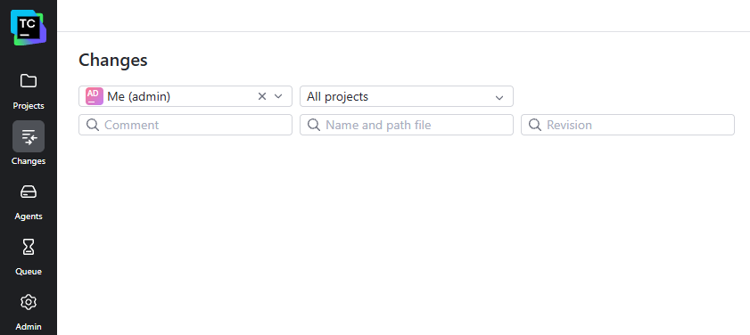

### 3. 
Создаю ещё один инстанс для агента я так понимаю.

Связь между node и TeamCity Server проверена.


### 4. 
Авторизовал:

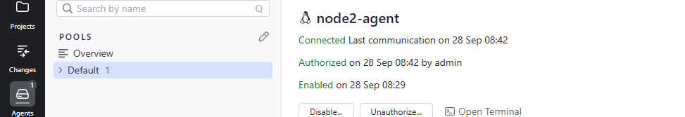

### 5. 

Дальше форк репозитория: https://github.com/Folau1/example_team_city
В мой Team City.

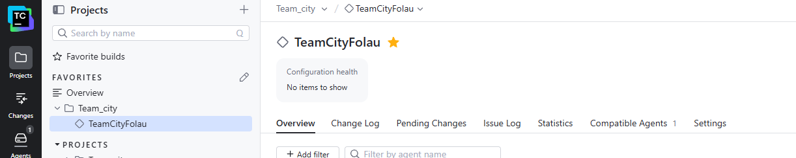

### 6. 

Создал VM и запускаем playbook:

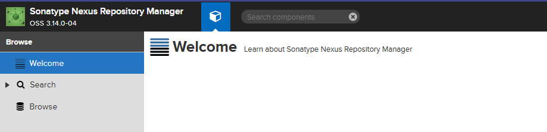

Подготовка завершена!

## Основная часть

### 1. Созадем новый проект на основании fork.

Сделал fork в TeamCity:

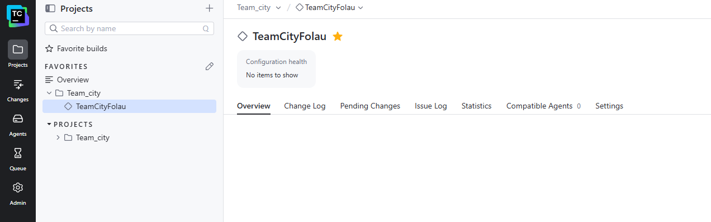

### 2. Сделать autodetect конфигурации.

Сделал нашёл maven и запустил:

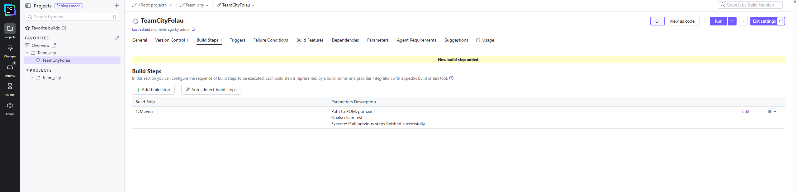

### 3. Запуск первого master.

Нажали RUN запустили сборку. Всё passed.

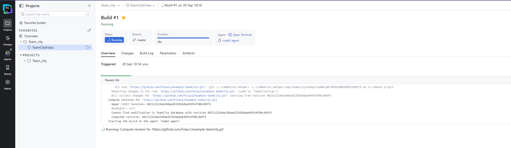

### 4. Меняем условия сборки.

Поменял условия и добавил новый шаг Deploy master

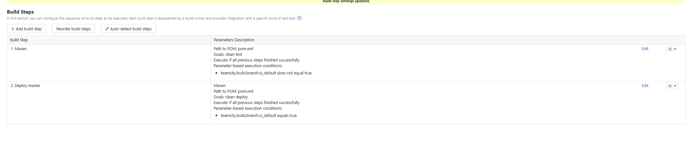

### 5. Загружаем settings в Maven

Сделал:

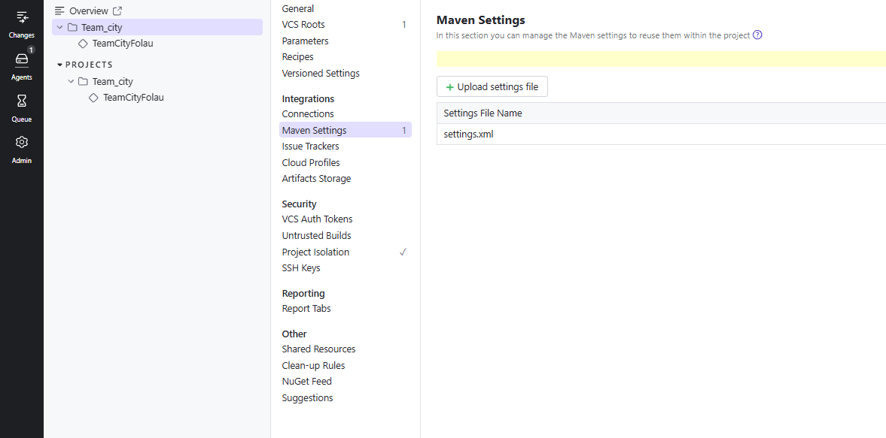

Кредиты идут стандартные.

### 6. Меняем ссылки на репозитории.

Меняем ссылку со стандартного pom на нашу ссылку.

Сохраняем пушим. Меняю ещё в Deploy Masters с Default на наш setting.
Запускаем run и видим что всё прошло успешно!
В первый раз забыл поменять у меня ошибку выдало из-за того что забыл поменять.

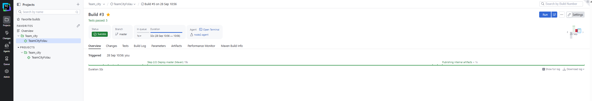

### 7. Запускаем сборку по master.

Т.к. run уже запустил выше для проверки, перешёл в Nexus и всё там появилось:

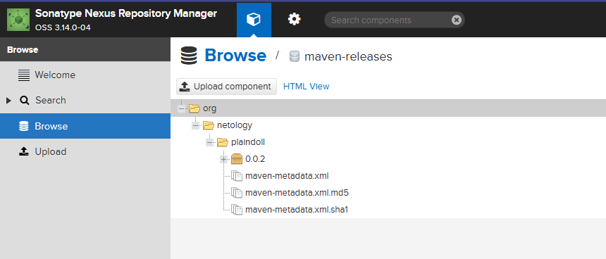

### 8. Миграция build в репозиторий

Сделал миграцию. Возникла проблема с подключением, пришлось делать токен Github чтобы подключить Team City.
Сделал, посмотрел, вышло сообщение:

```
	Changes from VCS are applied to project settings, last change 'Synchronization with own VCS root is enabled (TeamCity change in 'Team_city ' project)', revision 788b4bccd33cd6920815a5fe6bca90e56838b036, time spent: 6s,279ms 
```
Посмотрел в самом репозитории, появилась папка .teamcity. Миграция завершена!

### 9. Создаем отдельную feature/add_reply в репозитории.

Выполняем по очереди команды:

```
PS C:\Users\Наталья\Documents\Project_home\team_city> git switch -c feature/add_reply
Switched to a new branch 'feature/add_reply'
PS C:\Users\Наталья\Documents\Project_home\team_city> git branch
```

И дальше проверяем:

```
git branch
* feature/add_reply
```

### 10. Напишите новый метод для класса Welcomer

В классе Welcomer был добавлен новый метод:
```
public String sayReply() {
    return "Good hunter, the night is waiting for you.";
}
```
Метод возвращает строку, содержащую слово:
```
hunter
```

### 11. Добавление теста
Для нового метода был добавлен отдельный тест:
```
@Test
public void welcomerSaysReply() {
    assertThat(welcomer.sayReply(), containsString("hunter"));
}
```
Тест проверяет, что новый метод действительно возвращает строку со словом `hunter`.

### 12. Commit и push feature-ветки
Изменения были добавлены в Git:
```
git add src
git commit -m "Добавил reply с hunter"
git push -u origin feature/add_reply
```
Ветка появилась в GitHub:
```
feature/add_reply
```

### 13. Автоматический запуск сборки feature-ветки
В TeamCity был настроен VCS Trigger.
После нового изменения в ветке feature/add_reply TeamCity автоматически запустил сборку.
Результат:
```
Status: Success
Branch: feature/add_reply
Tests passed: 6
Agent: node2-agent
Triggered: Git
```
Для feature-ветки был выполнен только шаг:
```
mvn clean test
```

### 